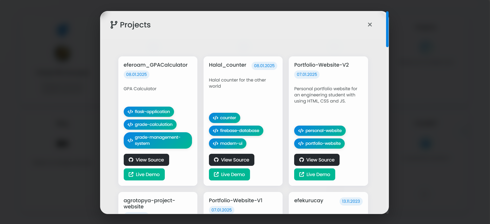

# GitHub Projects Integration

This project allows you to showcase your GitHub repositories on your website with an automatically updating, modern, and responsive design.



## 🚀 Features

- Automatic project listing with GitHub API
- Modern and responsive design
- Project details (description, technologies, star count)
- Automatic updates
- Easy customization

## 📦 Installation

1. Clone the project:
```bash
git clone https://github.com/username/github-integration.git
```

2. Set your GitHub username in `script.js`:
```javascript
const username = 'YOUR_GITHUB_USERNAME';
```

3. Upload files to your web server or run on localhost.

## 🛠️ Technologies Used

- HTML5
- CSS3
- JavaScript (ES6+)
- GitHub REST API
- Bootstrap 5
- Font Awesome

## 📝 Customization

### Color Scheme
You can modify color variables in `styles.css`:

```css
:root {
  --primary-color: #0366d6;
  --secondary-color: #24292e;
  /* other colors... */
}
```

### Card Design
You can customize project cards' design in `styles.css`.

## 🔍 API Limits

GitHub API has hourly and daily request limits:
- Unauthenticated requests: 60 requests/hour
- Authenticated requests: 5000 requests/hour

## 📄 License

MIT License - See [LICENSE](LICENSE) file for details.

## 🤝 Contributing

1. Fork the project
2. Create a feature branch (`git checkout -b feature/newFeature`)
3. Commit your changes (`git commit -am 'Add new feature: XYZ'`)
4. Push to the branch (`git push origin feature/newFeature`)
5. Create a Pull Request

## 📞 Contact

- Website: [efekurucay.com](https://efekurucay.com)
- GitHub: [@efekurucay](https://github.com/efekurucay)
- Medium: [@efekurucay](https://medium.com/@efekurucay) 